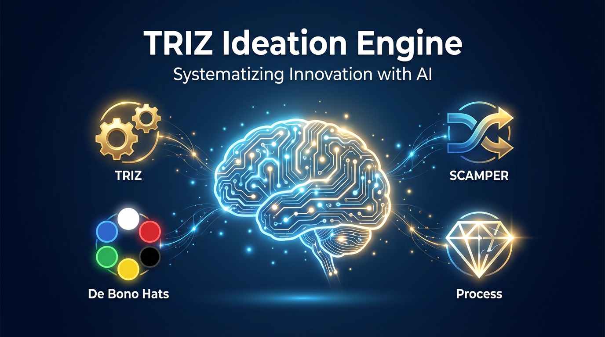
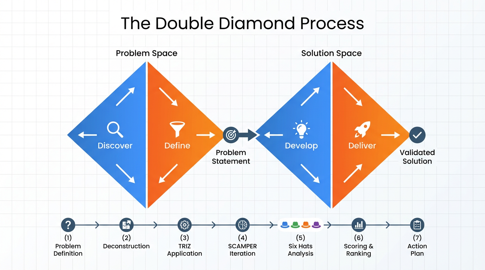
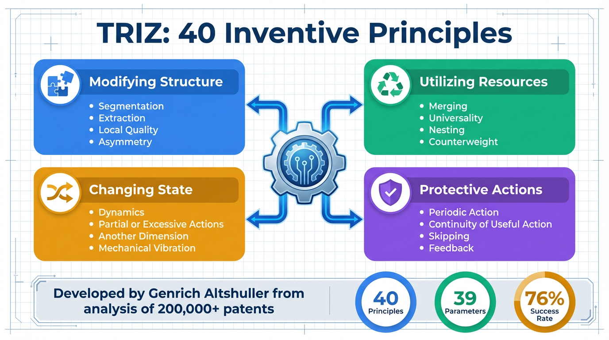
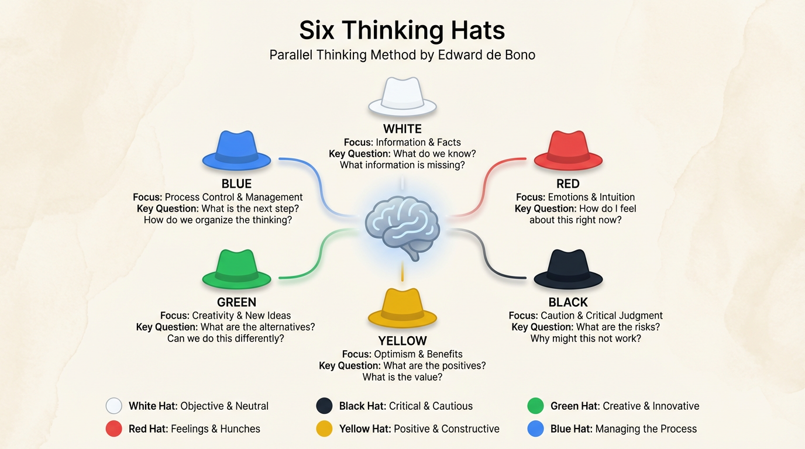
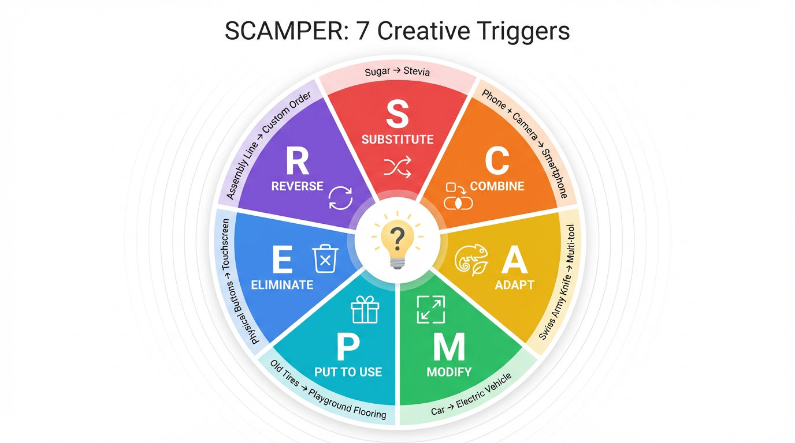
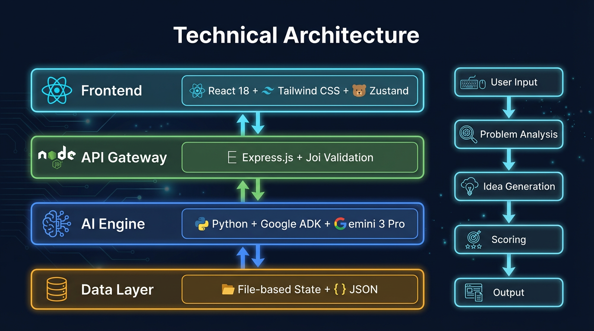
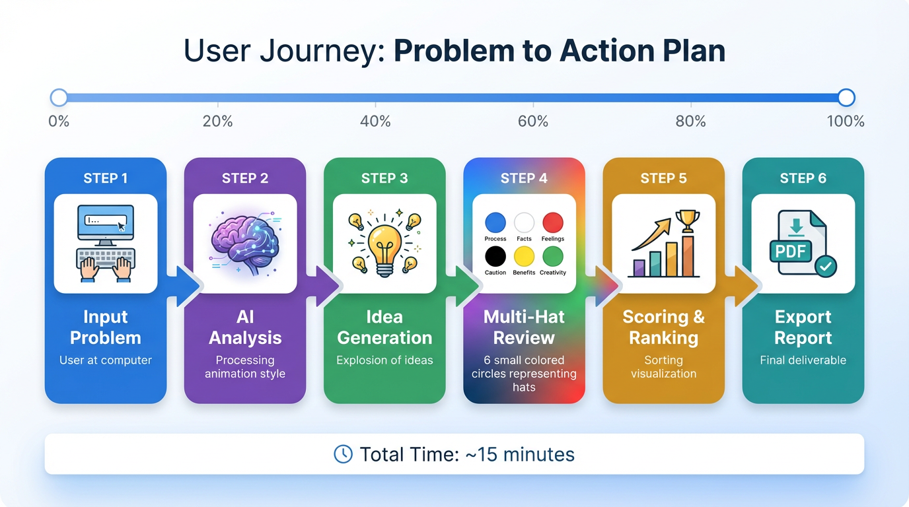
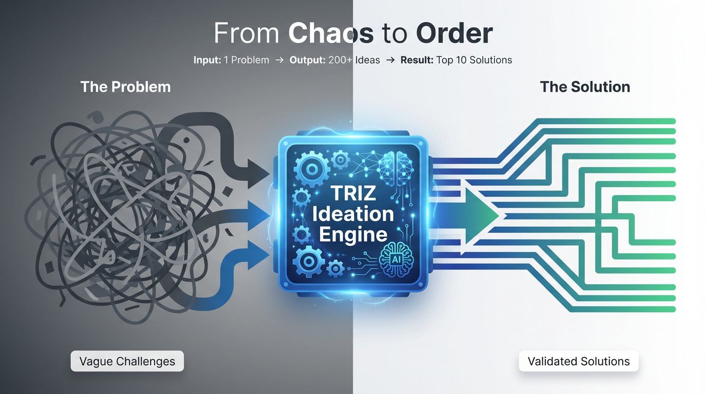
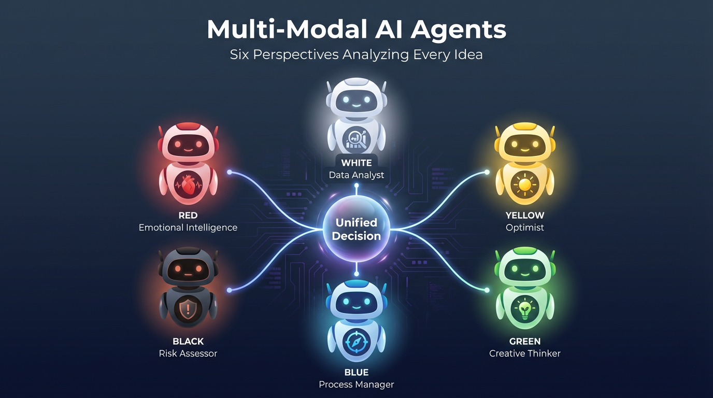

# 🧠 TRIZ Ideation Engine

> **AI-Powered Systematic Innovation Platform**  
> *Transform Vague Problems into Validated Solutions*



---

## 🎯 Overview

The **TRIZ Ideation Engine** is a next-generation innovation platform that fuses the algorithmic rigor of the Theory of Inventive Problem Solving (TRIZ) with the generative power of Google's **Gemini 3 Pro AI**.

Unlike traditional brainstorming tools that merely record ideas, this platform **actively generates them** using proven methodologies:

| Framework | Purpose | Output |
|-----------|---------|--------|
| **TRIZ** | Resolve technical contradictions | 40 inventive principles applied |
| **SCAMPER** | Iterative optimization | 7 creative triggers |
| **Six Thinking Hats** | Multi-perspective validation | Balanced evaluation |

---

## ⚡ Key Statistics

| Metric | Value |
|--------|-------|
| TRIZ Principles | 40 |
| Thinking Hats | 6 |
| SCAMPER Triggers | 7 |
| Ideas Per Session | 200+ |
| Time to Validation | ~15 minutes |

---

## 🔄 The Double Diamond Process



The engine implements a **7-phase Diamond Design** methodology with two cycles of divergence and convergence:

1. **Problem Definition** → Clear problem statement
2. **Deconstruction** → Problem components identified
3. **TRIZ Application** → 100+ raw ideas generated
4. **SCAMPER Iteration** → 200+ refined ideas
5. **Six Hats Analysis** → Multi-perspective evaluation
6. **Scoring & Ranking** → Top 10 solutions selected
7. **Action Plan** → Implementation roadmap

---

## 🛠️ TRIZ Methodology



**TRIZ** (Teoriya Resheniya Izobretatelskikh Zadach) was developed by Genrich Altshuller after analyzing 200,000+ patents. Key insight: **Innovation follows predictable patterns**.

### Core Concepts
- **Technical Contradictions**: Improving one parameter worsens another
- **Physical Contradictions**: System must be in two states simultaneously
- **40 Inventive Principles**: Proven solutions to resolve contradictions

---

## 🎩 De Bono's Six Thinking Hats



Each hat is implemented as a **specialized AI agent**:

| Hat | Focus | Question |
|-----|-------|----------|
| ⚪ White | Facts & Data | "What information do we have?" |
| 🔴 Red | Emotions | "How do users feel about this?" |
| ⚫ Black | Risks | "What could go wrong?" |
| 🟡 Yellow | Benefits | "What are the advantages?" |
| 🟢 Green | Creativity | "What alternatives exist?" |
| 🔵 Blue | Process | "What's our next step?" |

---

## 🔧 SCAMPER Method



Seven creative triggers for idea expansion:

- **S**ubstitute – Replace components
- **C**ombine – Merge with other elements
- **A**dapt – Alter for new use
- **M**odify – Change scale or attributes
- **P**ut to other use – Different purpose
- **E**liminate – Remove to simplify
- **R**everse – Turn inside out

---

## 🏗️ Technical Architecture



| Layer | Technology |
|-------|------------|
| Frontend | React 18, Tailwind CSS, Zustand |
| API Gateway | Express.js, Node.js, Joi Validation |
| AI Engine | Python, Google ADK, Gemini 3 Pro |
| Data Layer | File-based State, JSON |

### Quality Metrics
- **98** Unit Tests (Jest + pytest)
- **7** Modular Route Modules
- **100%** Input Validation Coverage

---

## 🚀 User Journey



| Step | Action | Time |
|------|--------|------|
| 1 | Input Problem | 2 min |
| 2 | AI Analysis | 1 min |
| 3 | Idea Generation | 5 min |
| 4 | Multi-Hat Review | 3 min |
| 5 | Scoring | 2 min |
| 6 | Export Report | 1 min |

**Total: ~15 minutes** from problem to validated solutions

---

## 🔮 The Transformation



### Why This Works

| Traditional Brainstorming | TRIZ Ideation Engine |
|--------------------------|---------------------|
| Random ideas | Algorithmic generation |
| Groupthink bias | AI-powered objectivity |
| Hours of meetings | 15 minutes |
| Unpredictable results | Repeatable process |
| Solution trap | Problem-first approach |

---

## 📦 Project Structure

```
04-New-Ideation-App-V2/
├── 03-TRIZ Main App/     # Main application
│   └── Triz_Ideation_App/  # Express server
├── adk-agent/            # Google ADK AI agent
├── web-app/              # React frontend
├── infographics/         # Generated visuals
├── knowledge/            # TRIZ frameworks & prompts
└── docs/                 # Documentation
```

---

## 🛡️ Security

See [SECURITY.md](SECURITY.md) for security policies and vulnerability reporting.

---

## 📄 License

© 2025 | Built with React, Python, Google ADK & Gemini 3 Pro

---

<p align="center">
  
</p>

===

OpenSource Idea generation Solution. 

Powered by ARIZ & TRIZ (X Axis), Edward Debono's DATT Tools and Human Intuition Techniques (Y Axiz), OpenVolve and AlphaEvolve Inspiration for Evolutionary Architectures for Self Improvement (Z Axis)

Phases
1. Optimization of LLM Prompting. Using RAG->Graph, Domain Knowledge in JSON, User Query Optimization
2. Idea Generation
3. Problem Solving
4. Product Roadmap Ideation and Product Manager's-Coach
5. Management Consulting
6. Movie Scripts
7. Life Coaching, Executive Coaching
8. Patent Ideation, and Inventor's-Coach
9. Algorithm Optimization
10. Molecular Discovery


====


Collaboration with the Repo :https://github.com/Khanna-Aman/Inventive_Problem_Solving_Using_TRIZ-Gemini-LLM/tree/main

